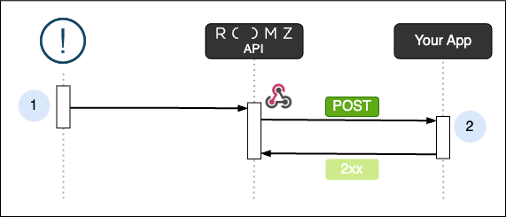

# ROOMZ's Public API Specification

This repository contains [OpenAPI specifications](https://www.openapis.org/) for ROOMZ's Public API.

>_Please contact the [Sales team](mailto:sales@roomz.io) if you are interested in joining the private preview, which is expected to open in Mid-July 2024._

---

# Webhook
Receive ROOMZ events in your webhook endpoint and trigger reactions in your integration.

1. When a resource changes, a Webhook event is posted to your webhook url.
2. Your application [receives an event](#receive-events) and must respond to it.

## Receive events 

### The WebhookEvent Object

For every change in resources, ROOMZ will post a WebhookEvent object to your webhook url. The WebhookEvent object is described in [ROOMZ's OpenAPI Specification](./openapi/spec3.yml)

### Use HTTPS

You should ensure that your receiving url uses an HTTPS connection.

### Use the webhook secret

Your webhook secret will be used to generate a hash signature that is sent to your application with the event in order to ensure that it is from ROOMZ.

The hash signature is included as the value of the `Roomz-Signature` header.

The hash signature is generated using your webhook secret and the event payload.

For more information on how to verify the signature, see the [signature verification](documentation/signature.md) documentation.

### Respond fast
Your integration should respond with a  ``2xx`` status code response as fast as possible.
Any other status codes are considered a delivery failure.

You might want to process the event asynchronously. Your integration can respond when it receives the webhook, and then process the payload in the background.

>Requests currently time out after 30 seconds, but this limit is subject to change in the future.

### Handle duplicate events
Your webhook url might sometimes receive the same event multiple times. 

To prevent receiving duplicate events, ensure your event handling is idempotent. 

One method is to log processed events and avoid reprocessing those already logged.
