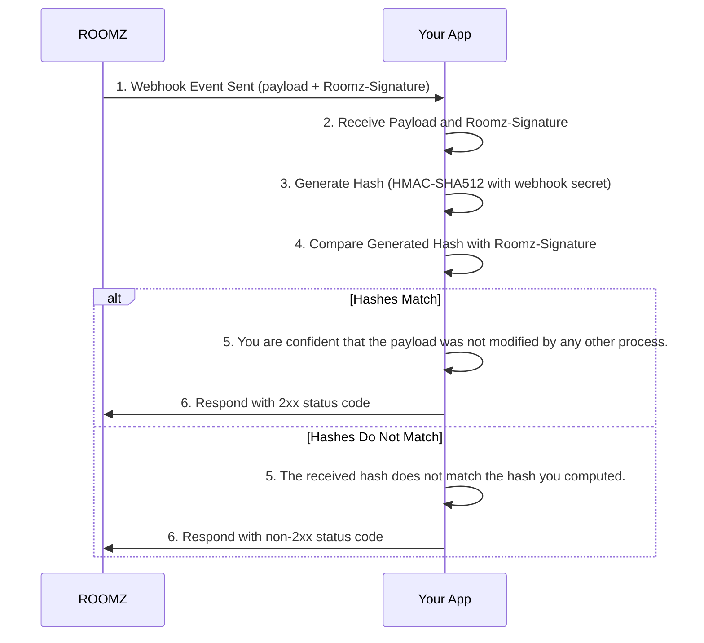

# Signature verification

For every change in resources, ROOMZ will post a Webhook event to your webhook URL. The event includes a hash
signature that is generated using your webhook secret provided by ROOMZ and the event payload. The signature is the
value of the header `Roomz-Signature`. Your application should verify the signature to ensure that the event was not
altered by another process, component, WAF, or other sources.

We use the **HMAC-SHA512** algorithm to generate the hash signature.

The following steps describe how we generate the hash signature and how it has to be verified:



## Sample code for signature verification

The following code snippet demonstrates an example how to verify the signature.

It is written in C# and uses the `HMACSHA512` class to generate the hash signature but can be adapted to other
languages.

```csharp
  bool CheckSignature()
  {
    var payload = "received_payload_here";
    var receivedSignature = "received_signature_here";
    var webhookSecret = "your_webhook_secret"; // Secret provided by ROOMZ

    // Generate the hash for the received payload
    var generatedSignature = GenerateSignature(webhookSecret, payload);

    // Compare the generated signature with the received signature
    if (generatedSignature == receivedSignature)
    {
      Console.WriteLine("You are confident that the payload was not modified by any other process.");
      return true;
    }

    Console.WriteLine("The received hash does not match the hash you computed.");
    return false;
  }

  static string GenerateSignature(string secret, string payload)
  {
    using HMACSHA512 hashAlgo = new(Encoding.UTF8.GetBytes(secret));
    return Convert.ToBase64String(hashAlgo.ComputeHash(Encoding.UTF8.GetBytes(payload)));
  }
```